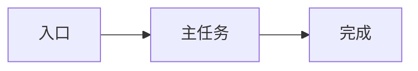

<!-- module-status: draft -->
<!-- sources: SRC-001 -->

## 用户与 JTBD [PRD-USERS]

| ID | 用户 | 情境 | 动机 | 期望进展 | 证据 |
|---|---|---|---|---|---|
| SCN-001 | | | | | SRC-001 |

## 流程 [PRD-FLOWS]

## 场景覆盖

- 正常流程：
- 备选流程：
- 空状态：
- 恢复：
- 权限拒绝：
- 边界：

## 确认

- 确认人：
- 确认时间：
