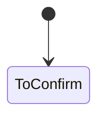

# 03 业务规则

<!-- stage-status: draft -->

## 业务规则

| ID | 规则 | 适用于 | 证据 |
|---|---|---|---|
| BR-001 | [TO CONFIRM] | SCN-001 | SRC-001 |

## 状态机

## 权限

| 角色 | 操作 | 数据范围 | 是否允许 | 备注 |
|---|---|---|---|---|
| [TO CONFIRM] | [TO CONFIRM] | [TO CONFIRM] | [TO CONFIRM] | |

## 异常与边界

- 空状态：
- 非法输入：
- 权限拒绝：
- 重复操作：
- 并发变更：
- 边界取值：

## 确认

- 确认人：
- 确认时间：
