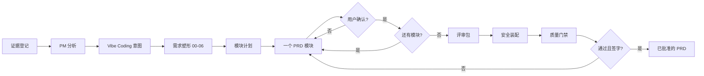

# 工作流契约（Workflow Contract）

## 目的

把不完整的产品输入，转化为一份可评审的 PRD，同时不隐藏不确定性、不丢失推理链路。

## 运作模型

工作流是一连串的审批门禁，而不是一次性的文档生成器：

## 证据账本（Evidence Ledger）

把每一条有意义的来源登记到 `inputs/source-notes.md`：

| ID | 类型 | 位置 | 支撑什么 | 置信度 | 状态 |
|---|---|---|---|---|---|
| SRC-001 | user-statement | conversation | 初始问题描述 | medium | active |

使用以下分类：

- **Fact 事实**：有引用来源直接支撑。
- **Assumption 假设**：合理但尚无支撑。
- **Unknown 未知**：做决策所需、但还缺失的信息。
- **Conflict 冲突**：来源相互矛盾，必须由用户裁决。

不要仅因为某个假设看起来合理就把它转成事实。

### 资料投喂（Materials Intake）

若用户把参考资料（旧 PRD、竞品、调研、会议纪要、导出数据等）放进了 `inputs/materials/`，在塑形开始前**逐份读取**（跳过占位的 `README.md`），并用 `add_source.py` 登记为 `SRC-*`：`location` 记 `inputs/materials/<文件名>`，按 Fact/Assumption 分类、标注置信度，并在 `00-discovery`/`00-intake` 引用。资料原件保留在该目录即可，不必复制到别处。

## 确认协议

- 每轮最多问 3-5 个问题。
- 只问那些实质影响价值、范围、行为、可行性、风险或验收的问题。
- 在请求确认前，先小结改了什么。
- 把已确认的阶段名与模块名记录到 `workspace.json`。
- 把决策记录到相关文件以及 PRD 决策日志。
- 绝不从沉默中默认确认。

## 塑形阶段（Shaping Stages）

### `00-discovery.md`

在投入之前先生成证据。框定机会，梳理这个想法所依赖的假设（需求性 desirability、商业性 viability、可行性 feasibility、可用性 usability），按风险排序，并为每个高风险假设定义验证方法。把假设记为 `ASM-*`，把计划中/已收集的来源登记进证据账本。参见 `references/discovery-playbook.md`。

当最高风险的假设要么已验证、要么已被显式接受为带负责人的风险，且发现结论为 `proceed`、`pivot` 或 `kill` 时退出。结论为 `pivot` 或 `kill` 时，不要推进到 intake。

### `00-intake.md`

记录来源、现状、问题陈述、期望、干系人、决策负责人、证据清单、约束与首批未知项。

当问题领域与决策负责人可被识别时退出。

### `01-value-and-truth.md`

验证需求是否真实、是否值得做。定义用户价值、业务价值、战略契合、影响范围、成本/风险等级、证据强度与备选方案。

当价值判断明确到足以支持或否决该产品工作时退出。

### `02-jtbd.md`

定义用户、情境、动机、期望进展、当前替代方案、痛点与可量化结果。

当主要 Job 与场景有了稳定 ID 时退出。

### `03-business-rules.md`

定义业务规则、状态机、权限、数据范围、异常情形、边缘情形与边界规则。

当核心产品行为可在无隐藏策略决策的情况下被评审时退出。

### `04-system-intent.md`

定义 Vibe Coding 意图：产品目标、系统边界、模块、输入、输出、约束、非决策项与完成标准。

当一个 AI 编码 Agent 能理解"该构建什么、不该决定什么"时退出。

### `05-scope-and-version.md`

定义 MVP、版本计划、优先级、非目标、暂缓项、依赖、发布边界与待解决问题。

当范围蔓延与版本漂移可被察觉时退出。

### `05-open-questions.md`（遗留别名）

跟踪未解决的问题、假设、冲突、负责人、阻断级别与解决条件。

既有的 v1 工作区可能仍含此文件。迁移时把它视为 `05-scope-and-version.md` 的一部分。

### `06-shaped-brief.md`

汇总产品定位、核心判断、目标用户、JTBD、范围、方案概要、成功度量、风险与证据质量。

当用户确认它可作为 PRD 的依据时退出。

## 停止条件

遇到以下情况时停下并请求用户输入：

- 最高风险假设既无验证计划、也无显式"接受为风险"的决策；
- 关键事实没有证据；
- 证据相互冲突；
- 范围归属不清；
- 目标无法被衡量或显式评估；
- 产品价值或战略契合未被陈述；
- Vibe Coding 意图缺少系统边界、输入、输出或完成标准；
- 某需求无法被做成可测试；
- 用户尚未确认当前阶段/模块；
- 装配后的 PRD 出现 hash 冲突，表明被手动改动过。

不要为非关键未知项停下；把它们连同负责人一起记录，只要其不确定性不改变当前决策就继续。
